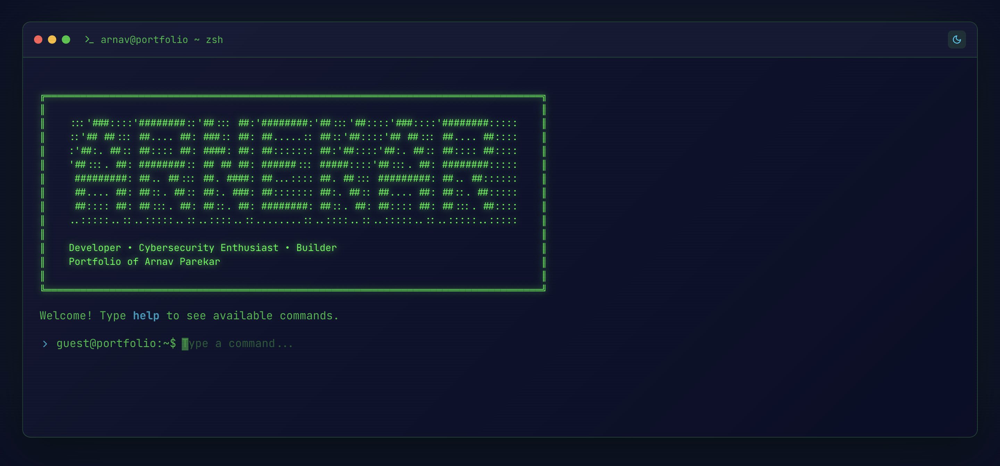
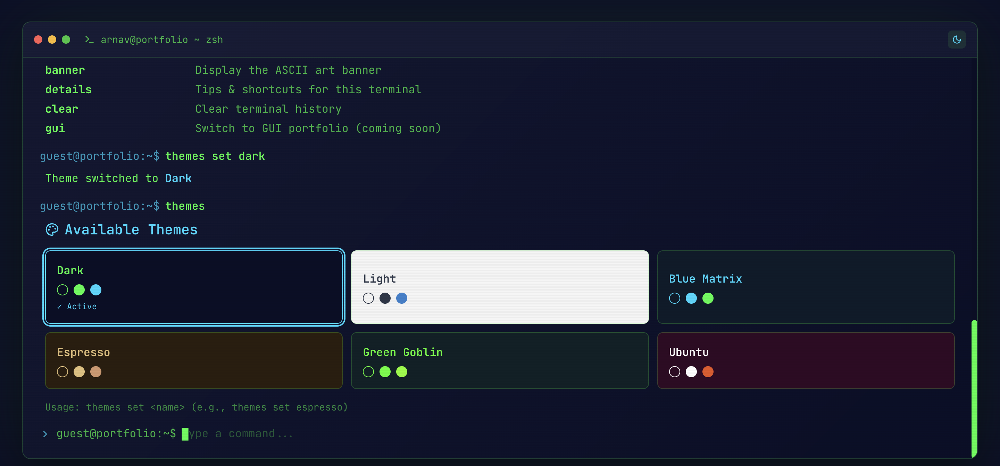
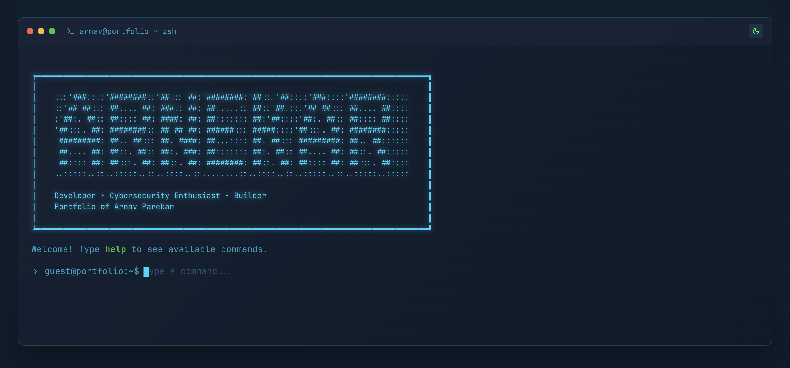
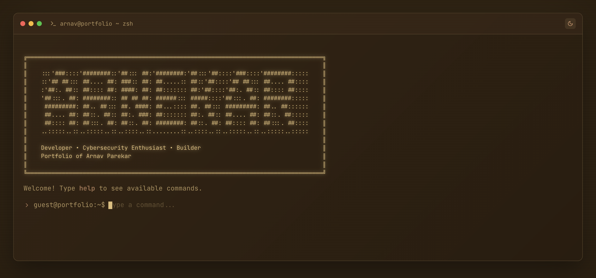
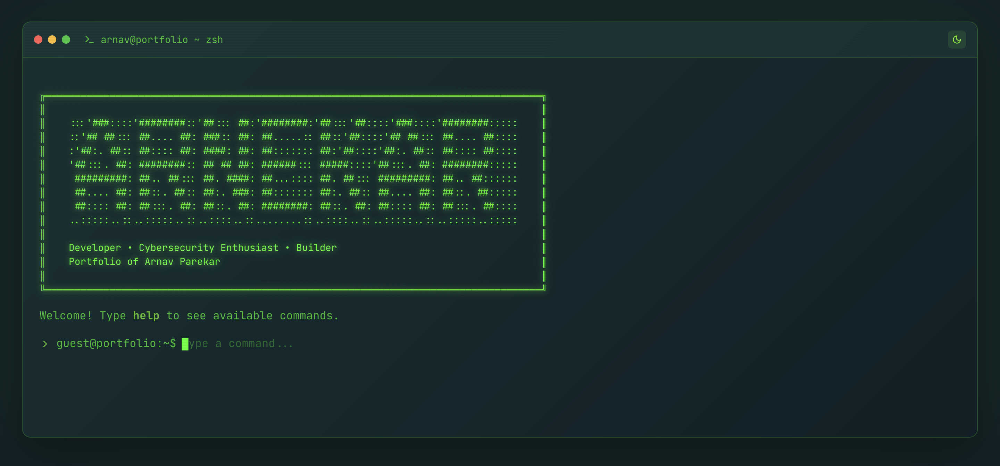
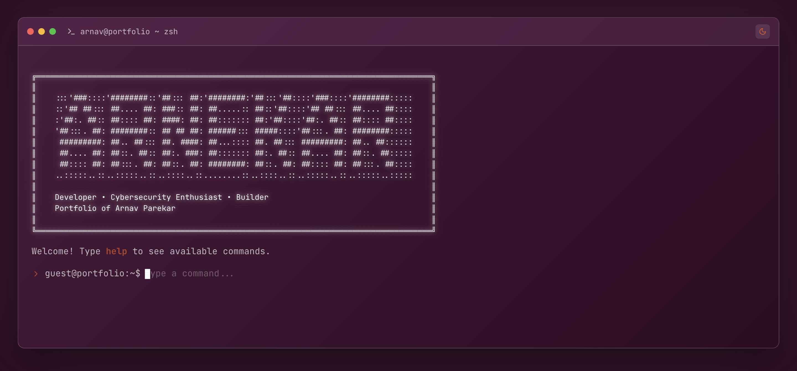
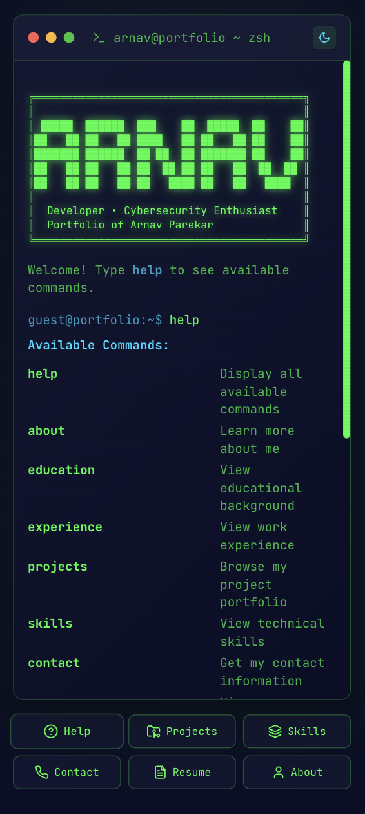

<div align="center">

<!-- Hero Banner -->


<br/>

# 🖥️ Terminal Portfolio

### A fully interactive, retro-inspired terminal portfolio — built for the modern web.

<br/>

[](https://nextjs.org/)
[](https://react.dev/)
[](https://www.typescriptlang.org/)
[](https://tailwindcss.com/)
[](https://www.framer.com/motion/)

<br/>

[**Live Demo →**](https://terminal-portfolio.vercel.app)&nbsp;&nbsp;&nbsp;·&nbsp;&nbsp;&nbsp;[**Report Bug**](https://github.com/arnavparekar/terminal-portfolio/issues)&nbsp;&nbsp;&nbsp;·&nbsp;&nbsp;&nbsp;[**Request Feature**](https://github.com/arnavparekar/terminal-portfolio/issues)

<br/>

</div>

---

<br/>

## ✨ Highlights

| | Feature | Description |
|---|---|---|
| 🎬 | **Cinematic Boot Sequence** | Character-streamed ASCII banner with a retro startup feel |
| 🎨 | **6 Hand-Crafted Themes** | Dark, Light, Blue Matrix, Espresso, Green Goblin, Ubuntu |
| ⌨️ | **Real Terminal UX** | Tab autocomplete, command history (↑/↓), streaming output |
| 🖼️ | **Project Gallery Modals** | Scrollable image galleries with intersection-synced dot indicators |
| 📱 | **Fully Responsive** | Mobile quick-action bar + compact ASCII banner |
| 📺 | **CRT Effects** | Scanline overlay + text glow for authentic retro vibes |
| 🧊 | **Glassmorphism UI** | Frosted-glass terminal window with depth and elegance |

<br/>

---

<br/>

## 📸 Screenshots

<div align="center">

### Dark Theme _(Default)_


<br/><br/>

<table>
<tr>
<td width="50%">

### 🔵 Blue Matrix


</td>
<td width="50%">

### ☕ Espresso


</td>
</tr>
<tr>
<td width="50%">

### 🟢 Green Goblin


</td>
<td width="50%">

### 🟣 Ubuntu


</td>
</tr>
</table>

<br/>

### 📱 Mobile View


</div>

<br/>

---

<br/>

## ⌨️ Commands

All interaction happens through the terminal prompt — just like a real shell.

```
 COMMAND              DESCRIPTION
 ─────────────────────────────────────────────────
 help                 Display all available commands
 about                Learn more about me
 education            View educational background
 experience           View work experience
 projects             Browse project portfolio
 skills               View technical skills
 contact              Get contact information
 resume               View or download resume
 neofetch             Display system info (Linux-style)
 themes               List available color themes
 themes set <name>    Switch to a specific theme
 banner               Display the ASCII art banner
 details              Tips & shortcuts for this terminal
 clear                Clear terminal history
```

<br/>

### 🔧 Terminal Shortcuts

| Key | Action |
|---|---|
| `Tab` | Autocomplete commands & theme names |
| `↑` `↓` | Navigate command history |
| `Enter` | Execute command |
| `Esc` | Close project modal |

> **Pro tip:** Type `themes set es` then press `Tab` — it autocompletes to `themes set espresso` ✨

<br/>

---

<br/>

## 🎨 Themes

Switch themes on-the-fly with `themes set <name>`. Your choice persists across sessions.

| Theme | Colors | Vibe |
|---|---|---|
| **Dark** _(default)_ | `#0a0e27` `#00ff41` `#00d9ff` | Classic hacker aesthetic |
| **Light** | `#f5f5f5` `#2d3748` `#3182ce` | Clean & accessible |
| **Blue Matrix** | `#0d1b2a` `#00d9ff` `#00ff41` | Cyberpunk neon |
| **Espresso** | `#2b1d0e` `#e4c07a` `#d4976c` | Warm coffee-shop coding |
| **Green Goblin** | `#0f2027` `#39ff14` `#7fff00` | Neon hacker energy |
| **Ubuntu** | `#300a24` `#ffffff` `#e95420` | The classic Linux look |

<br/>

---

<br/>

## 🚀 Quick Start

### Prerequisites

- **Node.js** ≥ 18
- **npm** ≥ 9

### Installation

```bash
# Clone the repository
git clone https://github.com/arnavparekar/terminal-portfolio.git

# Navigate to the project
cd terminal-portfolio

# Install dependencies
npm install

# Start the dev server
npm run dev
```

Open **[http://localhost:3000](http://localhost:3000)** — the terminal boots up automatically.

### Production Build

```bash
npm run build
npm start
```

<br/>

---

<br/>

## 📁 Project Structure

```
terminal-portfolio/
│
├── app/
│   ├── page.tsx              # Main terminal component (all logic + UI)
│   ├── layout.tsx            # Root layout, fonts, SEO metadata
│   └── globals.css           # Themes, CRT effects, glassmorphism, animations
│
├── public/
│   ├── projects/             # Project screenshots for gallery
│   ├── screenshots/          # README screenshots
│   └── resume.pdf            # Downloadable resume
│
├── tailwind.config.ts        # Tailwind configuration
├── next.config.js            # Next.js config
├── tsconfig.json             # TypeScript config
└── package.json
```

<br/>

---

<br/>

## 🛠️ Tech Stack

<div align="center">

| Layer | Technology | Purpose |
|---|---|---|
| **Framework** | Next.js 15 (App Router) | SSR, routing, performance |
| **UI Library** | React 19 | Component architecture |
| **Language** | TypeScript 5 | Type safety |
| **Styling** | Tailwind CSS 3.4 | Utility-first CSS |
| **Animations** | Framer Motion 11 | Smooth transitions & gestures |
| **Icons** | Lucide React | Consistent iconography |
| **Fonts** | JetBrains Mono | Monospace terminal aesthetic |
| **Bundler** | Turbopack | Blazing-fast dev builds |

</div>

<br/>

---

<br/>

## 🧩 Key Features — Deep Dive

### 🎬 Boot Sequence
The terminal opens with a character-by-character streamed ASCII art banner, simulating a real system boot. The animation adapts between a detailed desktop banner and a compact mobile version.

### 🖼️ Project Gallery
Each project card opens a modal with a horizontally scrollable image gallery. An `IntersectionObserver` syncs navigation dots to the currently visible image. Mobile devices get vertical scrolling with hidden dot indicators.

### ⌨️ Smart Autocomplete
Tab completion works for all commands **and** theme names. Typing a partial match and pressing `Tab` completes it — or finds the longest common prefix when there are multiple matches.

### 📺 CRT Scanline Effect
A subtle animated scanline overlay runs across the terminal, paired with a text-glow effect, to recreate the look of vintage CRT monitors without hurting readability.

### 🧊 Glassmorphism
The terminal window uses `backdrop-filter: blur()` with semi-transparent gradients and subtle borders to create a frosted-glass depth effect that adapts to each theme.

<br/>

---

<br/>

## 📝 Customization

This portfolio is designed to be easily forked and personalized:

1. **Personal Data** — Edit the constants at the top of `app/page.tsx` (`PROJECTS`, `SKILLS`, etc.)
2. **Resume** — Replace `public/resume.pdf` with your own
3. **Project Images** — Add screenshots to `public/projects/`
4. **Themes** — Add new themes to the `THEMES` array in `page.tsx`
5. **Commands** — Extend `processCommand()` and update `COMMANDS_LIST`

<br/>

---

<br/>

## � License

This project is open source and available under the [MIT License](LICENSE).

<br/>

---

<div align="center">

<br/>

**Built with ☕ and `console.log()` by [Arnav Parekar](https://github.com/arnavparekar)**

<br/>

⭐ Star this repo if you found it useful!

<br/>

</div>
